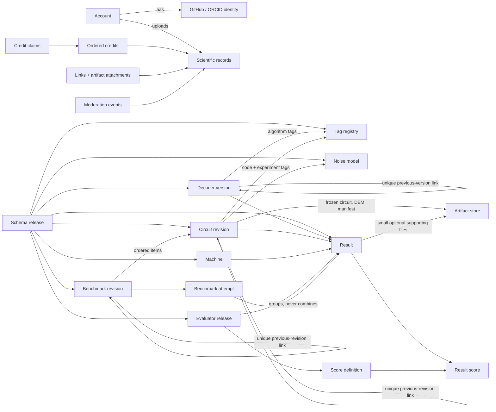

# DecoderBench data model 0.1



Status: complete relational draft for local prototyping and collaborator
critique. Every scientific contract version in this document is `0.1`. Version
`1` remains reserved for the first collaborator-reviewed public release.

Decision status: the decoder fields and result identity/provenance fields are
already frozen as draft 0.1. The rest of this document is a concrete proposal
for critique, including circuit, noise-model, outcome, timing, score,
benchmark, and governance fields. “Complete” means that the proposal has no
deliberately implicit tables or keys; it does not mean that every proposed
scientific choice has been approved.

This document is the complete proposed v0.1 relational model. It supersedes
`docs/relational-data-model.md` wherever the two differ. The existing frozen
decoder contract and frozen result identity/provenance contract remain
authoritative; this model supplies their relational representation and fills in
the surrounding records.

The two initial soft-output scores are deliberately **provisional test score
definitions**. Their presence tests the evaluator and storage architecture; it
does not settle the scientific choice of future headline metrics.

## 1. Design rules

1. PostgreSQL is the production database. Django models and migrations will be
   the executable physical schema. SQLite may be used for an early local UI,
   but production constraints are designed for PostgreSQL.
2. Every primary key is a server-generated UUID. Human labels and slugs are
   never identities.
3. Every retained scientific record points to the exact immutable
   `schema_release` under which it was created.
4. Published scientific content is immutable. Corrections create a replacement
   record and an explicit predecessor or supersession link. Withdrawal never
   deletes the old record.
5. Decoder, circuit, and benchmark histories have no separate family rows. The
   root revision is the lineage identity, the unique leaf is current, and the
   linear history is derived only from predecessor links.
6. A lineage root has a general description. Later descriptions are optional.
   A lineage page shows the newest non-null description found by walking back
   from the leaf, the leaf's mandatory revision description, and previous links.
7. A result is one self-contained claim over one declared set of shots. The
   site never pools or combines result records.
8. Aggregate facts and evaluator-derived scores are stored separately. Raw
   shot data and timing traces never leave the contributor's machine. Stored
   shot counts do not change when scoring definitions change.
9. A score meaning is immutable and versioned. A changed formula, input rule,
   confidence construction, tie rule, or population definition creates a new
   `score_definition` and normally a new `evaluator_release`.
10. Potentially large files live in object storage. PostgreSQL stores their
   hashes, metadata, ownership, and relationships.
11. Credits do not require accounts. A name string is not a person identifier
   and identical strings on different records assert no relationship.
12. Accounts have no local passwords in v0.1. A local account UUID is connected
    to one or more GitHub or ORCID identities.
13. Custom and official content use the same data structures. Official status
    is explicit governance metadata, never inferred from popularity.
14. Foreign keys to published scientific records use `ON DELETE RESTRICT`.
    Draft cleanup is an explicit application operation, not cascading deletion.

## 2. Type and naming conventions

| Notation | Meaning |
|---|---|
| `UUID` | PostgreSQL UUID, generated by the server |
| `TEXT` | Unicode text; non-empty constraints use `btrim(value) <> ''` |
| `TIMESTAMPTZ` | UTC instant rendered in the viewer's timezone |
| `NUMERIC(p,s)` | Exact decimal; never a binary floating-point database value |
| `JSONB` | Validated structured extension data whose schema is named explicitly |
| `SHA256` | Lower-case 64-character hexadecimal SHA-256 digest |
| lifecycle `state` | `draft`, `pending_review`, `published`, or `withdrawn` unless stated otherwise |

All contributor-controlled URLs must be absolute `https` URLs, except that
development fixtures may use `http://localhost`. Positions are one-based
positive integers. Public ordering never relies on UUID or creation order.

For the shared four-state lifecycle:

- `draft` and `pending_review` require both publication timestamps to be null;
- `published` requires `published_at` and a null `withdrawn_at`;
- `withdrawn` requires both `published_at` and `withdrawn_at`;
- a published row may move only to `withdrawn`, never back to an editable state.

## 3. Table catalogue

| Area | Tables |
|---|---|
| Identity | `account`, `external_identity` |
| Contracts and files | `schema_release`, `artifact`, `artifact_attachment`, `external_link` |
| Attribution | `credit`, `credit_claim` |
| Discovery | `tag`, `decoder_version_algorithm_tag`, `circuit_revision_code_tag`, `circuit_revision_experiment_tag` |
| Decoders | `decoder_version` |
| Noise and circuits | `noise_model`, `circuit_revision` |
| Evaluation | `machine`, `evaluator_release`, `score_definition`, `result`, `result_score`, `result_author_approval_event` |
| Benchmarks | `benchmark_revision`, `benchmark_revision_item`, `benchmark_attempt`, `benchmark_attempt_result` |
| Governance | `moderation_event` |

## 4. Identity

### 4.1 `account`

A stable local identity used for submission, ownership, approval, claims, and
moderation. It is not itself an authentication credential.

| Column | Type | Null | Key/default | Meaning |
|---|---:|:---:|---|---|
| `id` | UUID | no | PK | Stable account identity |
| `display_name` | TEXT | no | 1–200 chars | Current public name |
| `is_active` | BOOLEAN | no | default `true` | May authenticate and act |
| `is_admin` | BOOLEAN | no | default `false` | May curate and moderate |
| `created_at` | TIMESTAMPTZ | no | server default | |
| `updated_at` | TIMESTAMPTZ | no | server managed | |

There is deliberately no username, email address, password hash, or
local-password reset state. Authentication uses the immutable provider subject
in `external_identity`; email is neither required nor used to identify or
automatically merge accounts. If email notifications are introduced later,
they use a separate optional contact address verified by this site. Removing an
account with published activity means deactivating and, when required,
anonymising profile fields; it does not delete scientific records.

### 4.2 `external_identity`

| Column | Type | Null | Key/default | Meaning |
|---|---:|:---:|---|---|
| `id` | UUID | no | PK | |
| `account_id` | UUID | no | FK → `account.id` | Owning local account |
| `provider` | TEXT | no | `github` or `orcid` | Authentication provider |
| `provider_subject` | TEXT | no | | Provider's immutable subject ID |
| `provider_display_name` | TEXT | yes | | Last observed presentation name |
| `created_at` | TIMESTAMPTZ | no | server default | |
| `last_authenticated_at` | TIMESTAMPTZ | yes | | |

Constraints:

- unique (`provider`, `provider_subject`);
- unique (`account_id`, `provider`), so v0.1 links at most one identity from
  each provider to an account;
- the application prevents removal of an account's final identity;
- OAuth access and refresh tokens are not retained after authentication.

Account merging is not automatic in v0.1. A provider identity already attached
to another account enters an explicit administrator-assisted recovery process.

## 5. Versioned contracts and files

### 5.1 `artifact`

One immutable, content-addressed file. Bytes live locally in development and in
S3-compatible object storage in production.

| Column | Type | Null | Key/default | Meaning |
|---|---:|:---:|---|---|
| `id` | UUID | no | PK | |
| `sha256` | CHAR(64) | no | unique | Digest of the exact stored bytes |
| `byte_size` | BIGINT | no | check ≥ 0 | Exact byte count |
| `media_type` | TEXT | no | | Validated media type |
| `original_filename` | TEXT | no | | Display/download filename only |
| `storage_backend` | TEXT | no | `local` or `r2` | Byte store |
| `object_key` | TEXT | no | | Opaque storage key |
| `uploaded_by_id` | UUID | no | FK → `account.id` | Uploader |
| `created_at` | TIMESTAMPTZ | no | server default | |

Constraints:

- unique (`storage_backend`, `object_key`);
- `sha256` matches `^[0-9a-f]{64}$`;
- stored bytes are never overwritten in place;
- duplicate bytes reuse the existing artifact row after access checks;
- publication verifies that the object exists and recomputes its digest.

### 5.2 `schema_release`

The permanent bridge from a database record to its machine-readable shape and
human-readable scientific meaning.

| Column | Type | Null | Key/default | Meaning |
|---|---:|:---:|---|---|
| `id` | UUID | no | PK | |
| `record_type` | TEXT | no | controlled vocabulary | Kind of record governed |
| `version` | TEXT | no | | `0.1` for every initial release |
| `json_schema_artifact_id` | UUID | no | FK → `artifact.id` | Exact JSON Schema for the public record |
| `definitions_artifact_id` | UUID | no | FK → `artifact.id` | Exact human definitions file |
| `permanent_url` | TEXT | no | unique | Public canonical definition URL |
| `state` | TEXT | no | `draft`, `frozen`, `retired` | Contract lifecycle |
| `created_at` | TIMESTAMPTZ | no | server default | |
| `frozen_at` | TIMESTAMPTZ | yes | | Required when frozen/retired |

Constraints:

- unique (`record_type`, `version`);
- `record_type` initially permits `decoder`, `tag`, `noise_model`, `circuit`,
  `machine`, `evaluator`, `result`, and `benchmark`;
- a retained published record may reference only a frozen release;
- a frozen release and its artifacts are immutable;
- retiring a release prevents new submissions but does not invalidate existing
  records.

The public `schema` string is derived as `record_type/version` (for example,
`decoder/0.1` uses the decoder-version release). It is not independently typed
by a contributor.

Every top-level scientific record has its own required, direct
`schema_release_id`. The complete v0.1 mapping is:

| Public scientific record | `record_type` | Anchor table | Scientifically meaningful component rows covered by the same contract |
|---|---|---|---|
| Decoder version | `decoder` | `decoder_version` | Algorithm-tag memberships |
| Tag | `tag` | `tag` | None; it is a reusable controlled-vocabulary record |
| Noise model | `noise_model` | `noise_model` | None |
| Circuit revision | `circuit` | `circuit_revision` | Code/experiment-tag memberships |
| Machine | `machine` | `machine` | None |
| Evaluator release | `evaluator` | `evaluator_release` | `score_definition` rows |
| Result | `result` | `result` | `result_score` rows |
| Benchmark revision | `benchmark` | `benchmark_revision` | Items, attempts, and attempt-result memberships |

Before any record of these types can be published or referenced by a published
record, its checked-in
`schemas/<record_type>/0.1.schema.json` and
`definitions/<record_type>/0.1.md` must exist and be frozen as the two
artifacts named by `schema_release`. The JSON Schema defines the complete
public record, including its component arrays; the definitions file gives the
human scientific meaning of every scientific field. Infrastructure fields may
be documented without separate scientific definitions.

A relational helper row does not repeat `schema_release_id` when it has exactly
one unambiguous owning scientific record. It inherits that owner's contract;
duplicating the key would permit contradictory declarations. Reusable linked
scientific records, such as a tag, machine, or noise model, are not helpers and
therefore carry their own direct schema-release key. A `result_score` is
additionally bound to its exact immutable `score_definition`, which supplies
the numeric meaning as well as the result schema supplying its storage shape.

Accounts, authentication identities, credits and claims, external links,
moderation events, and object-storage bookkeeping are operational,
attribution, or audit data rather than scientific content. Django migrations
still define and version their database shape, but they do not receive
scientific `schema_release` records.

Database migration numbers are intentionally absent. Django migrations version
the physical database; `schema_release` versions scientific interchange and
meaning.

### 5.3 `artifact_attachment`

Optional supporting files which are not represented by a record's dedicated
artifact columns.

| Column | Type | Null | Key/default | Meaning |
|---|---:|:---:|---|---|
| `id` | UUID | no | PK | |
| `artifact_id` | UUID | no | FK → `artifact.id` | Attached file |
| `decoder_version_id` | UUID | yes | FK → `decoder_version.id` | Subject option |
| `noise_model_id` | UUID | yes | FK → `noise_model.id` | Subject option |
| `circuit_revision_id` | UUID | yes | FK → `circuit_revision.id` | Subject option |
| `result_id` | UUID | yes | FK → `result.id` | Subject option |
| `evaluator_release_id` | UUID | yes | FK → `evaluator_release.id` | Subject option |
| `benchmark_revision_id` | UUID | yes | FK → `benchmark_revision.id` | Subject option |
| `role` | TEXT | no | | Subject-specific controlled role |
| `position` | INTEGER | no | check ≥ 1 | Display order within role |
| `created_at` | TIMESTAMPTZ | no | server default | |

Exactly one subject foreign key is non-null. Unique (`subject`, `role`,
`position`) and unique (`subject`, `artifact_id`) are enforced with partial
indexes for each subject type.

Initial roles include `source_archive`, `documentation`, `configuration`,
`reproduction_bundle`, and `other`. Required circuit, DEM, manifest, and
hyperparameter files use dedicated columns instead. Raw shot data and timing
traces are never accepted as stored artifacts.

### 5.4 `external_link`

| Column | Type | Null | Key/default | Meaning |
|---|---:|:---:|---|---|
| `id` | UUID | no | PK | |
| `decoder_version_id` | UUID | yes | FK → `decoder_version.id` | Subject option |
| `noise_model_id` | UUID | yes | FK → `noise_model.id` | Subject option |
| `circuit_revision_id` | UUID | yes | FK → `circuit_revision.id` | Subject option |
| `result_id` | UUID | yes | FK → `result.id` | Subject option |
| `evaluator_release_id` | UUID | yes | FK → `evaluator_release.id` | Subject option |
| `benchmark_revision_id` | UUID | yes | FK → `benchmark_revision.id` | Subject option |
| `kind` | TEXT | no | | `paper`, `source`, `documentation`, `artifact`, `configuration`, `raw_trace`, or `other` |
| `url` | TEXT | no | | Absolute URL |
| `label` | TEXT | yes | 1–200 chars when present | Presentation text |
| `position` | INTEGER | no | check ≥ 1 | Display order |
| `created_at` | TIMESTAMPTZ | no | server default | |

Each (`subject`, `url`) is unique. Link edits on published records are audited
metadata changes; they do not silently change scientific fields.

## 6. Credits and claims

### 6.1 `credit`

One ordered attribution token on one record. It deliberately does not represent
a globally deduplicated person.

| Column | Type | Null | Key/default | Meaning |
|---|---:|:---:|---|---|
| `id` | UUID | no | PK | |
| `decoder_version_id` | UUID | yes | FK → `decoder_version.id` | Subject option |
| `noise_model_id` | UUID | yes | FK → `noise_model.id` | Subject option |
| `circuit_revision_id` | UUID | yes | FK → `circuit_revision.id` | Subject option |
| `result_id` | UUID | yes | FK → `result.id` | Subject option |
| `benchmark_revision_id` | UUID | yes | FK → `benchmark_revision.id` | Subject option |
| `position` | INTEGER | no | check ≥ 1 | Ordered credit position |
| `display_name` | TEXT | yes | 1–200 chars | Unverified name-string option |
| `account_id` | UUID | yes | FK → `account.id` | Registered-account option |
| `hidden_at` | TIMESTAMPTZ | yes | | Name hidden after an approved claim |
| `created_at` | TIMESTAMPTZ | no | server default | |

Constraints:

- exactly one subject foreign key is non-null;
- exactly one of `display_name` and `account_id` is non-null;
- unique (`subject`, `position`) among visible credits through per-subject
  partial indexes with `WHERE hidden_at IS NULL`;
- account credits cannot be hidden;
- a published decoder version, circuit revision, noise model, result, or
  benchmark revision has at least one visible credit;
- identical `display_name` values do not imply common identity.

The record's `submitted_by_id` is separate and is never inferred from credits.

### 6.2 `credit_claim`

An audited request to connect a name-string credit with an account.

| Column | Type | Null | Key/default | Meaning |
|---|---:|:---:|---|---|
| `id` | UUID | no | PK | |
| `name_credit_id` | UUID | no | FK → `credit.id` | Claimed name credit |
| `claimant_account_id` | UUID | no | FK → `account.id` | Claimant |
| `retain_name_credit` | BOOLEAN | no | | Whether the old string remains publicly visible |
| `state` | TEXT | no | `pending`, `approved`, `rejected`, `cancelled` | Workflow state |
| `reviewed_by_id` | UUID | yes | FK → `account.id` | Uploader or administrator |
| `created_account_credit_id` | UUID | yes | FK → `credit.id` | Account credit made on approval |
| `created_at` | TIMESTAMPTZ | no | server default | |
| `reviewed_at` | TIMESTAMPTZ | yes | | Required after review |
| `review_note` | TEXT | yes | | |

Application rules:

- `name_credit_id` must be a visible name-string credit;
- the normal reviewer is the `submitted_by_id` of the subject record; an admin
  override is allowed and recorded in `moderation_event`;
- approval creates a new account credit on the same subject;
- if `retain_name_credit=false`, approval sets the old credit's `hidden_at` and
  gives the new account credit its former position;
- if `retain_name_credit=true`, the application shifts later visible positions
  and inserts the account credit immediately after the retained string;
- the original name and the complete decision remain in the audit trail;
- at most one pending claim exists for (`name_credit_id`,
  `claimant_account_id`).

## 7. Tag registry

### 7.1 `tag`

One registry serves algorithm, experiment, and code tags.

| Column | Type | Null | Key/default | Meaning |
|---|---:|:---:|---|---|
| `id` | UUID | no | PK | Stable tag identity |
| `schema_release_id` | UUID | no | FK → `schema_release.id` | Must govern `tag` |
| `namespace` | TEXT | no | `algorithm`, `experiment`, or `code` | Tag axis |
| `slug` | TEXT | no | | Stable URL/export slug |
| `label` | TEXT | no | 1–200 chars | Display label |
| `description` | TEXT | no | | Human meaning |
| `status` | TEXT | no | `custom`, `official`, or `deprecated` | Curation lifecycle |
| `canonical_tag_id` | UUID | yes | self-FK → `tag.id` | Replacement after merge/deprecation |
| `submitted_by_id` | UUID | no | FK → `account.id` | Creator |
| `curated_by_id` | UUID | yes | FK → `account.id` | Last admin curator |
| `created_at` | TIMESTAMPTZ | no | server default | |
| `updated_at` | TIMESTAMPTZ | no | server managed | |
| `curated_at` | TIMESTAMPTZ | yes | | |

Constraints and behaviour:

- unique (`namespace`, `slug`);
- slugs match `^[a-z0-9]+(?:-[a-z0-9]+)*$`;
- `canonical_tag_id` is not self and has the same namespace;
- a custom tag may be promoted to official in place without changing `id`;
- merged/deprecated slugs continue resolving to their canonical tag;
- search presents official matches before custom matches;
- after first scientific use, a tag's namespace, slug, and scientific meaning
  are immutable; a semantic change creates a new tag row;
- status promotion, aliasing, and non-semantic wording corrections do not
  create new decoder or circuit revisions.

### 7.2 Tag membership tables

Each membership table has a two-column primary key and `ON DELETE RESTRICT`
foreign keys.

| Table | Primary key | Namespace rule |
|---|---|---|
| `decoder_version_algorithm_tag` | (`decoder_version_id`, `tag_id`) | tag namespace is `algorithm` |
| `circuit_revision_code_tag` | (`circuit_revision_id`, `tag_id`) | tag namespace is `code` |
| `circuit_revision_experiment_tag` | (`circuit_revision_id`, `tag_id`) | tag namespace is `experiment` |

Namespace compatibility is checked by the publication transaction because a
plain foreign key cannot express it across tables.

## 8. Decoders

### 8.1 `decoder_version`

There is no decoder-family table. A root version has
`previous_version_id = NULL`; its `id` is the stable identity of the derived
lineage. Following predecessor links reaches the root, and following the unique
child reaches the current leaf.

| Column | Type | Null | Key/default | Meaning |
|---|---:|:---:|---|---|
| `id` | UUID | no | PK | Exact decoder-version identity |
| `schema_release_id` | UUID | no | FK → `schema_release.id` | Must govern `decoder` |
| `slug` | TEXT | no | unique, slug format | Direct-link slug for this exact version only |
| `name` | TEXT | no | 1–200 chars | Public name at this version |
| `version` | TEXT | no | 1–100 chars | Contributor version label |
| `previous_version_id` | UUID | yes | unique self-FK | Direct predecessor; null only at a root |
| `description` | TEXT | yes | 1–10,000 chars | Optional replacement general description |
| `revision_description` | TEXT | no | 1–10,000 chars | What this exact version introduced/changed |
| `circuit_skeleton_preparation` | TEXT | no | `required` or `not_required` | Decoder-level preparation capability |
| `circuit_priors_preparation` | TEXT | no | `required` or `not_required` | Decoder-level preparation capability |
| `provides_failure_probability` | BOOLEAN | no | | Can emit the defined per-shot probability |
| `hyperparameter_definitions` | TEXT | yes | max 20,000 chars | Free-text hyperparameter meanings |
| `hyperparameter_schema_artifact_id` | UUID | yes | FK → `artifact.id` | Optional Draft 2020-12 JSON Schema |
| `submitted_by_id` | UUID | no | FK → `account.id` | Uploader |
| `state` | TEXT | no | lifecycle | |
| `created_at` | TIMESTAMPTZ | no | server default | |
| `published_at` | TIMESTAMPTZ | yes | | |
| `withdrawn_at` | TIMESTAMPTZ | yes | | |

Constraints and publication rules:

- `slug` is globally unique but does not identify or group a lineage;
- unique `previous_version_id` where non-null, so a predecessor has at most one
  child and branching is impossible;
- predecessor is not self and the history is acyclic;
- version labels are unique within the lineage, checked by walking the chain;
- a root has a non-null description; later versions may have null descriptions;
- the current version is the unique leaf and is never stored separately;
- the lineage page starts at that leaf, walks backwards to the first non-null
  `description`, shows it with the leaf's `revision_description`, and links the
  earlier versions;
- the root-version form prepopulates the mandatory revision-description field
  with `first revision`; later forms provide no default; the database field
  itself is always non-null and has no default;
- at least one visible credit is required;
- optional hyperparameter schema is UTF-8 JSON, at most 32 KiB, declares and
  validates under JSON Schema Draft 2020-12, has top-level instance type
  `object`, and does not fetch remote references;
- published scientific fields are immutable, except audited predecessor
  correction, credit claims, tag curation, and withdrawal;
- material changes to corrections, probabilities, preparation, or
  hyperparameter behaviour require a new version.

`not_required` for either preparation dimension has the strict ten-second,
first-uncached-exposure meaning in `definitions/decoder/0.1.md`.

`provides_failure_probability=true` means that each completed invocation can
return `q ∈ [0,1]`, claimed to be the conditional probability that its returned
correction has at least one logical error. A raw gap or ranking score does not
qualify.

## 9. Noise models and circuits

### 9.1 `noise_model`

An exact, compact registry entry rather than an in-database mathematical noise
specification. Exact realised probabilities remain frozen in the circuit and
DEM artifacts.

| Column | Type | Null | Key/default | Meaning |
|---|---:|:---:|---|---|
| `id` | UUID | no | PK | Exact entry identity |
| `schema_release_id` | UUID | no | FK → `schema_release.id` | Must govern `noise_model` |
| `slug` | TEXT | no | unique | Stable public slug |
| `name` | TEXT | no | 1–200 chars | |
| `short_description` | TEXT | no | 1–2,000 chars | Human summary |
| `paper_url` | TEXT | no | | Primary paper/specification link |
| `randomises_priors` | BOOLEAN | no | | Whether this noise construction randomises exact priors |
| `supersedes_noise_model_id` | UUID | yes | self-FK | Semantic correction/replacement |
| `curation_status` | TEXT | no | `community`, `official`, or `deprecated` | Governance status |
| `submitted_by_id` | UUID | no | FK → `account.id` | Uploader |
| `state` | TEXT | no | lifecycle | Publication state |
| `created_at` | TIMESTAMPTZ | no | server default | |
| `published_at` | TIMESTAMPTZ | yes | | |
| `withdrawn_at` | TIMESTAMPTZ | yes | | |

Constraints and behaviour:

- the superseded entry is not self;
- at least one visible credit is required;
- admins may promote `community` to `official` without changing scientific
  meaning or ID; this action is audited;
- changing the description's scientific meaning or `randomises_priors`
  creates a new entry and uses `supersedes_noise_model_id`;
- there is no license field and no attempt to encode the full noise model in
  relational columns.

### 9.2 `circuit_revision`

One immutable sampling circuit together with its exact DEM, generation
parameters, scientific metadata, and manifest. There is no circuit-family
table; the root revision is the stable lineage identity.

| Column | Type | Null | Key/default | Meaning |
|---|---:|:---:|---|---|
| `id` | UUID | no | PK | Exact revision identity |
| `schema_release_id` | UUID | no | FK → `schema_release.id` | Must govern `circuit` |
| `slug` | TEXT | no | unique, slug format | Direct-link slug for this exact revision only |
| `name` | TEXT | no | 1–200 chars | Public name at this revision |
| `previous_revision_id` | UUID | yes | unique self-FK | Direct predecessor; null only at a root |
| `description` | TEXT | yes | max 10,000 chars | Optional replacement general description |
| `revision_description` | TEXT | no | 1–10,000 chars | What changed or was introduced |
| `noise_model_id` | UUID | no | FK → `noise_model.id` | Exact registry entry |
| `is_css` | BOOLEAN | no | | Whether the represented circuit is CSS |
| `code_distance_upper_bound` | INTEGER | yes | check ≥ 1 | Declared code-distance upper bound |
| `circuit_distance_upper_bound` | INTEGER | yes | check ≥ 1 | Declared circuit-distance upper bound |
| `rounds` | INTEGER | yes | check ≥ 1 | Declared rounds where meaningful |
| `num_detectors` | BIGINT | no | check ≥ 0 | Server-derived from frozen circuit/DEM |
| `num_errors` | BIGINT | no | check ≥ 0 | Server-derived Stim DEM error count |
| `num_observables` | BIGINT | no | check ≥ 1 | Server-derived logical observable count |
| `dem_x_detectors_only` | BOOLEAN | no | | Every detector is classified X-type |
| `dem_z_detectors_only` | BOOLEAN | no | | Every detector is classified Z-type |
| `stim_version` | TEXT | no | | Exact Stim version used for DEM generation |
| `dem_generation_method` | TEXT | no | constant `stim.Circuit.detector_error_model` | |
| `dem_decompose_errors` | BOOLEAN | no | | Exact passed value, including default |
| `dem_flatten_loops` | BOOLEAN | no | | Exact passed value, including default |
| `dem_allow_gauge_detectors` | BOOLEAN | no | | Exact passed value, including default |
| `dem_approximate_disjoint_errors` | JSONB | no | boolean or number in `[0,1]` | Exact passed union-typed value |
| `dem_ignore_decomposition_failures` | BOOLEAN | no | | Exact passed value, including default |
| `dem_block_decomposition_from_introducing_remnant_edges` | BOOLEAN | no | | Exact passed value, including default |
| `sampling_circuit_artifact_id` | UUID | no | FK → `artifact.id` | Frozen Stim circuit |
| `detector_error_model_artifact_id` | UUID | no | FK → `artifact.id` | Frozen Stim DEM, including exact priors |
| `manifest_artifact_id` | UUID | no | FK → `artifact.id` | Canonical manifest covering every scientific field/file |
| `submitted_by_id` | UUID | no | FK → `account.id` | Uploader |
| `state` | TEXT | no | lifecycle | |
| `created_at` | TIMESTAMPTZ | no | server default | |
| `published_at` | TIMESTAMPTZ | yes | | |
| `withdrawn_at` | TIMESTAMPTZ | yes | | |

Constraints and publication rules:

- `slug` is globally unique but does not identify or group a lineage;
- unique `previous_revision_id` where non-null, so branching is impossible;
- each required artifact role is distinct unless byte identity is explicitly
  valid and accepted by the schema;
- `previous_revision_id` is not self and the history is acyclic;
- the root is the lineage identity and has a non-null description;
- later descriptions are optional; the lineage page is derived from the unique
  leaf and shows the newest non-null description, the leaf's mandatory
  `revision_description`, and links to previous revisions;
- the root form prepopulates `revision_description` with `first revision` and
  later forms provide no default;
- if either detector-only boolean is true, `is_css` is true;
- both detector-only booleans cannot be true when `num_detectors > 0`;
- code and circuit distance fields are expressly **upper bounds**, not claims
  of exact distance;
- `num_detectors`, `num_errors`, and `num_observables` are reproduced by the
  server from the frozen artifacts rather than trusted form inputs;
- every supported argument to the named Stim DEM-generation method is recorded
  explicitly, even when its default was used;
- the manifest records the schema release, artifact hashes, noise-model ID,
  tags, all Stim parameters, distances, and derived counts;
- v0.1 stores both the sampling circuit and its generated DEM. If DEM size later
  makes circuit-only storage preferable, that policy is introduced by a new
  circuit schema release; existing revisions keep their stored DEMs;
- at least one code tag, one experiment tag, and one visible credit are
  required for publication;
- there is no license field;
- changing the circuit, DEM, realised priors, generation parameters, tags that
  carry scientific classification, distance bounds, or noise model creates a
  new revision.

`noise_model.randomises_priors` is followed from the referenced noise model; it
is not copied into this table. Exact realised priors remain in the frozen
circuit and DEM.

## 10. Machines

### 10.1 `machine`

A small reusable execution-environment record. It is required only when a
result reports timing or another machine-dependent score.

| Column | Type | Null | Key/default | Meaning |
|---|---:|:---:|---|---|
| `id` | UUID | no | PK | Exact machine record |
| `schema_release_id` | UUID | no | FK → `schema_release.id` | Must govern `machine` |
| `slug` | TEXT | no | unique | Public slug |
| `class` | TEXT | no | `cpu`, `gpu`, `fpga`, `asic`, or `hybrid` | Leaderboard partition |
| `description` | TEXT | no | 1–2,000 chars | Exact device/resources used |
| `status` | TEXT | no | `physical`, `simulated`, or `estimated` | Evidence type |
| `supersedes_machine_id` | UUID | yes | self-FK | Corrected description |
| `submitted_by_id` | UUID | no | FK → `account.id` | |
| `state` | TEXT | no | lifecycle | |
| `created_at` | TIMESTAMPTZ | no | server default | |
| `published_at` | TIMESTAMPTZ | yes | | |
| `withdrawn_at` | TIMESTAMPTZ | yes | | |

A published machine record is immutable. Machine classes are never normalized
into one universal performance ranking.

## 11. Evaluators and generic scores

### 11.1 `evaluator_release`

An immutable release of the common evaluator: source code, input/output
contracts, score membership, and exact calculation semantics.

| Column | Type | Null | Key/default | Meaning |
|---|---:|:---:|---|---|
| `id` | UUID | no | PK | Exact evaluator release |
| `schema_release_id` | UUID | no | FK → `schema_release.id` | Must govern `evaluator` |
| `version` | TEXT | no | unique | `0.1` initially |
| `source_url` | TEXT | no | | Canonical source repository URL |
| `source_revision` | TEXT | no | | Immutable commit identifier |
| `source_bundle_artifact_id` | UUID | no | FK → `artifact.id` | Frozen executable/reference source |
| `input_contract_url` | TEXT | no | | Permanent definition of accepted local inputs |
| `summary_contract_url` | TEXT | no | | Permanent definition of the submitted summary |
| `submitted_by_id` | UUID | no | FK → `account.id` | Release maintainer |
| `state` | TEXT | no | `draft`, `published`, `withdrawn` | |
| `created_at` | TIMESTAMPTZ | no | server default | |
| `published_at` | TIMESTAMPTZ | yes | | |
| `withdrawn_at` | TIMESTAMPTZ | yes | | |

The source bundle includes deterministic conformance fixtures. Browser and
Python/command-line implementations must reproduce them before release.

Raw shot data stays on the contributor's machine. The browser or command-line
evaluator reads it locally and produces a small summary conforming to
`summary_contract_url`. Submission validates that summary and writes its counts
and score values directly into `result` and `result_score`. The site neither
uploads nor retains the raw input or the submitted summary as an artifact.

### 11.2 `score_definition`

A generic, immutable definition of one numeric quantity emitted by one
evaluator release.

| Column | Type | Null | Key/default | Meaning |
|---|---:|:---:|---|---|
| `id` | UUID | no | PK | Exact score-definition identity |
| `evaluator_release_id` | UUID | no | FK → `evaluator_release.id` | Owning calculation release |
| `key` | TEXT | no | slug format | Stable key within release |
| `version` | TEXT | no | | `0.1` initially |
| `name` | TEXT | no | 1–200 chars | Display name |
| `description` | TEXT | no | | Short human explanation |
| `definition_url` | TEXT | no | | Permanent detailed definition |
| `direction` | TEXT | no | `lower_is_better`, `higher_is_better`, or `not_ranked` | Ranking direction |
| `unit` | TEXT | no | | E.g. `probability`, `seconds`, `dimensionless` |
| `primary_value_kind` | TEXT | no | `estimate`, `lower_bound`, or `upper_bound` | Which stored value is compared |
| `required_inputs` | JSONB | no | object | Exact shot/timing columns required |
| `parameters` | JSONB | no | object | Frozen parameters such as 0.95 or 0.05 |
| `is_provisional` | BOOLEAN | no | default `true` in v0.1 | Not a released scientific standard |
| `display_order` | INTEGER | no | check ≥ 1 | |

Constraints:

- unique (`evaluator_release_id`, `key`);
- unique (`evaluator_release_id`, `display_order`);
- unique (`id`, `evaluator_release_id`) supports composite result-score FKs;
- changing any formula, confidence method, acceptance/tie rule, required input,
  parameter, direction, or interpretation creates a new row under a new
  evaluator release;
- arbitrary contributor-defined score rows are not permitted. Definitions are
  installed by a reviewed evaluator release.

This is a controlled generic score table, not an unconstrained entity–attribute
store: each row has a versioned definition, numeric shape, evaluator code, and
permanent semantics.

### 11.3 Provisional evaluator 0.1 score seeds

These two rows exist only to exercise the infrastructure:

| Key | Primary value | Required shot fields | Frozen parameters | Status |
|---|---|---|---|---|
| `brier-loss-upper-95` | upper 95% confidence bound on mean Brier loss | logical-failure outcome and predicted failure probability | confidence `0.95`; confidence construction belongs to evaluator `0.1` | provisional test |
| `ler-upper-95-at-5pct-acceptance` | upper 95% confidence bound on conditional LER | logical-failure outcome and predicted failure probability | confidence `0.95`; target acceptance `0.05`; ranking/tie rule belongs to evaluator `0.1` | provisional test |

The data model does not assert that these will remain headline scores. Replacing
either later adds definitions; it does not rewrite their historical values.

## 12. Results

### 12.1 `result`

One self-contained statistical claim for exactly one decoder version, one
circuit revision, one evaluator release, one hyperparameter configuration, and
one declared set of attempted shots.

| Column | Type | Null | Key/default | Meaning |
|---|---:|:---:|---|---|
| `id` | UUID | no | PK | Result identity |
| `schema_release_id` | UUID | no | FK → `schema_release.id` | Must govern `result` |
| `decoder_version_id` | UUID | no | FK → `decoder_version.id` | Exact decoder version |
| `circuit_revision_id` | UUID | no | FK → `circuit_revision.id` | Exact circuit revision |
| `evaluator_version_id` | UUID | no | FK → `evaluator_release.id` | Exact evaluator version; name fixed by result contract |
| `machine_id` | UUID | yes | FK → `machine.id` | Required for machine-dependent measurements |
| `description` | TEXT | yes | max 10,000 chars | Optional result-specific explanation |
| `hyperparameter_values` | TEXT | yes | max 20,000 chars | Optional free-text values |
| `hyperparameter_values_artifact_id` | UUID | yes | FK → `artifact.id` | Optional frozen UTF-8 JSON object, max 8 KiB |
| `shots_total` | BIGINT | no | check ≥ 1 | All attempted shots in this result |
| `successful_shots` | BIGINT | no | check ≥ 0 | Returned valid correction, no logical failure |
| `logical_failure_shots` | BIGINT | no | check ≥ 0 | Returned valid correction with ≥1 logical error |
| `timeout_shots` | BIGINT | no | check ≥ 0 | No result before the specified timeout |
| `decoder_error_shots` | BIGINT | no | check ≥ 0 | Crash, nonconvergence, or invalid decoder output |
| `failure_probability_shots` | BIGINT | no | check ≥ 0 | Shots with a valid claimed failure probability |
| `latency_shots` | BIGINT | no | check ≥ 0 | Shots with valid standard-boundary latency |
| `preparation_duration_seconds` | NUMERIC(24,9) | yes | check ≥ 0 | Optional actual pre-first-syndrome preparation time |
| `training_workload_description` | TEXT | yes | max 20,000 chars | Optional result-specific training/preparation detail |
| `software_environment` | TEXT | yes | max 20,000 chars | Optional versions/build/runtime description |
| `t_1000_ns` | BIGINT | yes | check > 0 | Optional finite-burst time until the 1,000th correction returns |
| `supersedes_result_id` | UUID | yes | self-FK, unique when non-null | Corrected result |
| `reproduction_status` | TEXT | no | server managed | `independent_reproduction` or `decoder_author_verified` |
| `submitted_by_id` | UUID | no | FK → `account.id` | Uploader |
| `state` | TEXT | no | lifecycle | |
| `created_at` | TIMESTAMPTZ | no | server default | |
| `published_at` | TIMESTAMPTZ | yes | | |
| `withdrawn_at` | TIMESTAMPTZ | yes | | |

Core constraints:

```text
shots_total = successful_shots
            + logical_failure_shots
            + timeout_shots
            + decoder_error_shots

failure_probability_shots <= successful_shots + logical_failure_shots
latency_shots             <= successful_shots + logical_failure_shots
```

Additional constraints and rules:

- the uploaded hyperparameter object rejects duplicate keys and, when the
  decoder version provides a hyperparameter schema, validates against it;
- unique (`id`, `evaluator_version_id`) supports composite score-integrity
  foreign keys;
- reporting failure probabilities requires
  `decoder_version.provides_failure_probability=true`;
- `machine_id` is non-null when `latency_shots > 0`, `t_1000_ns` is present,
  or any emitted score definition declares machine-dependent inputs;
- the submitted local-evaluator summary names the exact evaluator release,
  every included score definition, aggregate counts, confidence components,
  and definition-required details;
- the server validates the summary's schema, internal arithmetic, ranges,
  required fields, and score membership, then writes the values directly into
  `result` and `result_score`;
- neither the local shot data nor the submitted summary is retained as an
  artifact, so the server does not claim to independently reproduce scores;
- a superseding result is not self and uses the same decoder version and
  circuit revision; materially different work is a separate result rather than
  a correction;
- no database operation pools results. Even identical-looking repeated runs
  remain separate;
- at least one visible credit is required;
- published scientific fields, counts, artifacts, and scores are immutable.

The four outcome categories preserve the three distinct failure modes:
logical failure, timeout, and other decoder failure. Score definitions decide
how timeout and decoder-error shots enter a particular denominator; the raw
facts are never reclassified silently.

`reproduction_status` is derived as follows:

- `decoder_author_verified` when the uploader is an account credited on the
  exact decoder version, or a currently credited account has an active approval
  event for the result;
- `independent_reproduction` otherwise.

A name-only decoder credit cannot authenticate an approval.

### 12.2 `result_score`

One locally computed, server-validated numeric summary for one result and one
score definition.

| Column | Type | Null | Key/default | Meaning |
|---|---:|:---:|---|---|
| `result_id` | UUID | no | PK part | Result |
| `score_definition_id` | UUID | no | PK part | Exact score meaning |
| `evaluator_version_id` | UUID | no | composite-FK component | Must match result and definition |
| `value` | NUMERIC(38,20) | no | | Canonical value selected by `primary_value_kind` |
| `point_estimate` | NUMERIC(38,20) | yes | | Underlying estimate when applicable |
| `lower_bound` | NUMERIC(38,20) | yes | | |
| `upper_bound` | NUMERIC(38,20) | yes | | |
| `confidence_level` | NUMERIC(8,7) | yes | check `(0,1)` | E.g. `0.95` |
| `sample_count` | BIGINT | yes | check ≥ 0 | Effective observations |
| `event_count` | BIGINT | yes | check ≥ 0 | Relevant observed events |
| `details` | JSONB | no | default `{}` | Definition-validated ancillary output |

Primary key: (`result_id`, `score_definition_id`).

Composite integrity:

- (`result_id`, `evaluator_version_id`) references the unique pair on `result`;
- (`score_definition_id`, `evaluator_version_id`) references
  (`score_definition.id`, `score_definition.evaluator_release_id`);
- `value` equals the column selected by the definition's
  `primary_value_kind`;
- bounds, confidence, counts, and `details` obey the named definition;
- absent/not-applicable scores have no row; they are not stored as zero.

### 12.3 `result_author_approval_event`

Append-only decoder-author approval history.

| Column | Type | Null | Key/default | Meaning |
|---|---:|:---:|---|---|
| `id` | UUID | no | PK | |
| `result_id` | UUID | no | FK → `result.id` | |
| `account_id` | UUID | no | FK → `account.id` | Approving/revoking decoder author |
| `action` | TEXT | no | `approve` or `revoke` | |
| `note` | TEXT | yes | | |
| `created_at` | TIMESTAMPTZ | no | server default | |

The account must be a visible account credit on the result's exact decoder
version at event time. The latest event per (`result_id`, `account_id`) decides
whether that account currently approves. Events are never edited or deleted.

## 13. Benchmarks

### 13.1 `benchmark_revision`

An immutable, ordered community or official collection of exact circuit
revisions. Approval and official recognition are deliberately distinct. There
is no benchmark-family table; the root revision is the stable lineage identity.

| Column | Type | Null | Key/default | Meaning |
|---|---:|:---:|---|---|
| `id` | UUID | no | PK | Exact benchmark revision |
| `schema_release_id` | UUID | no | FK → `schema_release.id` | Must govern `benchmark` |
| `slug` | TEXT | no | unique, slug format | Direct-link slug for this exact revision only |
| `name` | TEXT | no | 1–200 chars | Public name at this revision |
| `version` | TEXT | no | | Contributor version label |
| `previous_revision_id` | UUID | yes | unique self-FK | Direct predecessor; null only at a root |
| `description` | TEXT | yes | 1–10,000 chars | Optional replacement scope/purpose description |
| `revision_description` | TEXT | no | 1–10,000 chars | What this revision introduced or changed |
| `recognition_status` | TEXT | no | `community_submitted`, `admin_approved`, `official`, or `deprecated` | Governance standing |
| `manifest_artifact_id` | UUID | no | FK → `artifact.id` | Exact ordered membership manifest |
| `submitted_by_id` | UUID | no | FK → `account.id` | |
| `state` | TEXT | no | lifecycle | |
| `created_at` | TIMESTAMPTZ | no | server default | |
| `published_at` | TIMESTAMPTZ | yes | | |
| `withdrawn_at` | TIMESTAMPTZ | yes | | |

Constraints and behaviour:

- `slug` is globally unique but does not identify or group a lineage;
- unique `previous_revision_id` where non-null, so branching is impossible;
- predecessor is not self and the history is acyclic;
- version labels are unique within the derived lineage;
- the root has a description; later descriptions are optional;
- the page is derived from the unique leaf and shows the newest non-null
  description, the leaf's mandatory `revision_description`, and previous links;
- the root form prepopulates `revision_description` with `first revision` and
  later forms provide no default;
- publication requires `admin_approved` or `official`;
- admin approval does not imply official status;
- a transition to `official` is a separate admin action and moderation event;
- changing membership or meaning creates a new revision;
- no aggregate benchmark score is present in v0.1.

### 13.2 `benchmark_revision_item`

| Column | Type | Null | Key/default | Meaning |
|---|---:|:---:|---|---|
| `benchmark_revision_id` | UUID | no | PK part, FK | |
| `circuit_revision_id` | UUID | no | PK part, FK | Exact included circuit |
| `position` | INTEGER | no | unique within revision, check ≥ 1 | Manifest order |
| `is_required` | BOOLEAN | no | default `true` | Required for a complete attempt |

Only published circuit revisions may appear in a published benchmark revision.
The rows must reproduce the frozen manifest exactly.

### 13.3 `benchmark_attempt`

A grouping of already-existing results; it never combines their shots or
recalculates them as one result.

| Column | Type | Null | Key/default | Meaning |
|---|---:|:---:|---|---|
| `id` | UUID | no | PK | |
| `benchmark_revision_id` | UUID | no | FK → `benchmark_revision.id` | Exact gamut |
| `decoder_version_id` | UUID | no | FK → `decoder_version.id` | Decoder used throughout |
| `submitted_by_id` | UUID | no | FK → `account.id` | |
| `description` | TEXT | yes | | |
| `state` | TEXT | no | lifecycle | |
| `created_at` | TIMESTAMPTZ | no | server default | |
| `published_at` | TIMESTAMPTZ | yes | | |
| `withdrawn_at` | TIMESTAMPTZ | yes | | |

### 13.4 `benchmark_attempt_result`

| Column | Type | Null | Key/default | Meaning |
|---|---:|:---:|---|---|
| `benchmark_attempt_id` | UUID | no | PK part, FK | |
| `circuit_revision_id` | UUID | no | PK part, FK | Required item identity |
| `result_id` | UUID | no | unique within attempt, FK | Existing result |

Publication verifies that:

- every required benchmark item has exactly one result row;
- there are no results for circuits outside the benchmark revision;
- each result references the attempt's decoder version and the stated circuit
  revision;
- constituent results remain independent records and may be reused in another
  attempt;
- different machines/evaluator releases are visible rather than normalized
  away. A future benchmark contract may impose stricter homogeneity.

## 14. Governance audit

### 14.1 `moderation_event`

Append-only human governance history for actions not already completely
captured by claim or approval event tables.

| Column | Type | Null | Key/default | Meaning |
|---|---:|:---:|---|---|
| `id` | UUID | no | PK | |
| `actor_account_id` | UUID | no | FK → `account.id` | Administrator/reviewer |
| `decoder_version_id` | UUID | yes | FK | Subject option |
| `noise_model_id` | UUID | yes | FK | Subject option |
| `circuit_revision_id` | UUID | yes | FK | Subject option |
| `machine_id` | UUID | yes | FK | Subject option |
| `result_id` | UUID | yes | FK | Subject option |
| `tag_id` | UUID | yes | FK | Subject option |
| `benchmark_revision_id` | UUID | yes | FK | Subject option |
| `evaluator_release_id` | UUID | yes | FK | Subject option |
| `action` | TEXT | no | controlled vocabulary | |
| `note` | TEXT | no | | Human reason |
| `details` | JSONB | no | default `{}` | Structured before/after references |
| `created_at` | TIMESTAMPTZ | no | server default | |

Exactly one subject FK is non-null. Initial actions include `submitted`,
`requested_changes`, `approved`, `rejected`, `published`, `withdrawn`,
`promoted_official`, `deprecated`, `merged`, and `admin_credit_claim_override`.
Events are immutable.

## 15. Publication transaction

Publication is one audited application transaction. It checks all ordinary
database constraints plus the following cross-row rules:

1. The record's schema release is frozen and is of the correct record type.
2. Every required artifact exists, has the recorded byte count, and reproduces
   its SHA-256 digest.
3. Every referenced scientific record is already published and not withdrawn,
   unless a contract explicitly permits otherwise.
4. Required visible credits exist.
5. Decoder, circuit, and benchmark histories are acyclic and strictly linear:
   every record has at most one predecessor, every predecessor has at most one
   child, and each root has a general description.
6. Decoder hyperparameter schemas and result hyperparameter objects pass all
   size, JSON, duplicate-key, meta-schema, and instance-validation checks.
7. Circuit counts and the DEM reproduce from the frozen Stim circuit and the
   complete recorded DEM-generation arguments.
8. Circuit tag namespaces are correct and the manifest matches every
   scientific field and artifact digest.
9. Result aggregate counts add up and probability/timing capabilities are
   consistent with the decoder and machine fields.
10. The submitted local-evaluator summary conforms to the named evaluator
    release; its arithmetic, ranges, definition membership, and direct
    `result_score` projection validate. No raw data reproduction is claimed.
11. Result reproduction status is derived from account credits and current
    approval events.
12. A benchmark revision's item rows exactly match its manifest, and its
    approval and official-recognition states are not conflated.
13. A benchmark attempt contains exactly one eligible result for every required
    item and never combines their data.

## 16. Immutability and allowed metadata changes

After publication, the following scientific content cannot be edited:

- decoder capability, preparation, description, hyperparameter, and version
  fields;
- a used tag's namespace, slug, and scientific meaning;
- noise-model scientific meaning and randomisation property;
- circuit files, DEM, priors, tags, distances, Stim parameters, counts, and
  noise-model reference;
- result references, aggregate facts, hyperparameters, execution facts, and
  scores;
- evaluator source, contracts, definitions, and score membership;
- benchmark membership, order, and description.

The following audited metadata may change without a scientific replacement:

- account display profile;
- approved credit claims and visibility of the claimed name string;
- tag promotion, merge, deprecation, and wording corrections that preserve its
  scientific meaning;
- community → official curation status where scientific meaning is unchanged;
- external-link repair where the target content is unchanged;
- lifecycle withdrawal;
- result decoder-author approval events.

If there is doubt about whether a change is semantic, create a new record.

## 17. Required indexes

Primary and unique constraints create their normal indexes. Add these indexes
for the initial query patterns:

| Index | Columns/predicate | Purpose |
|---|---|---|
| `idx_tag_search` | (`namespace`, `status`, `label`) | Official-first tag search |
| `idx_result_circuit_state` | (`circuit_revision_id`, `state`, `created_at DESC`) | Circuit results |
| `idx_result_decoder_state` | (`decoder_version_id`, `state`, `created_at DESC`) | Decoder results |
| `idx_result_machine` | (`machine_id`, `state`) where `machine_id IS NOT NULL` | Timing partitions |
| `idx_result_score_ranking` | (`score_definition_id`, `value`, `result_id`) | Score leaderboard |
| `idx_result_supersedes` | unique (`supersedes_result_id`) where non-null | One direct correction |
| `idx_credit_account` | (`account_id`) where non-null and `hidden_at IS NULL` | Authenticated authorship/claims |
| `idx_benchmark_item_position` | (`benchmark_revision_id`, `position`) | Ordered gamut |

Indexes for text search, JSON, or new leaderboard filters are added only after
their actual queries exist. Run `ANALYZE` after representative seed data and
inspect `EXPLAIN (ANALYZE, BUFFERS)` before adding speculative indexes.

## 18. Initial deletion policy

- Published or withdrawn scientific rows: never hard-delete.
- Draft records with no retained review history: owner/admin may delete through
  an explicit service operation.
- Accounts: deactivate; never cascade into scientific records.
- External identities: may be unlinked only while another identity remains.
- Artifacts: bytes may be garbage-collected only when no row references the
  artifact and no audit/backup retention rule applies.
- Tags: deprecate or merge; never delete a slug that has appeared publicly.
- All scientific FKs and audit FKs: `ON DELETE RESTRICT`.

## 19. Deliberate v0.1 omissions

The model intentionally does not include:

- decoder execution or submitted-code sandboxing;
- site-side pooling of results;
- a final calibration metric or final confidence-interval convention;
- an aggregate benchmark score;
- a universal CPU/GPU/FPGA/ASIC normalization;
- a full relational encoding of noise mathematics;
- a separate code-family table—the code taxonomy is tag based;
- arbitrary user-defined score values;
- local passwords or stored OAuth API tokens;
- licenses on circuit or noise-model records;
- storage of raw shot data, syndrome data, or timing traces;
- deletion of published scientific history.

The provisional evaluator 0.1 supplies enough score definitions to exercise the
local evaluate → submit summary → validate → store → rank path. Scientific
replacement later means adding new immutable releases and definitions, not
modifying these rows.

## 20. Evolution and migrations

Scientific schema evolution and physical database migration are separate:

1. A Django migration changes the current PostgreSQL representation. Applied
   migrations are append-only history and are never edited in place.
2. A `schema_release` fixes the meaning and interchange shape of a retained
   scientific record. Historical records continue pointing to their original
   release and are not required to validate against the latest release.
3. Adding an ordinary storage field uses an expand–migrate–contract sequence:
   add it nullable, deploy compatible code, backfill deterministically where
   valid, verify, then add stricter constraints in a later migration.
4. Changing scientific meaning creates a new field/score definition and a new
   schema or evaluator release. The old field and definition remain available
   for historical records.
5. The server cannot re-evaluate historical results because it has no raw shot
   data. A contributor who retains the data may run a new evaluator locally and
   submit a new result which supersedes the old one. The old values retain their
   original meaning and are never relabelled.
6. Destructive cleanup is a later, separate migration performed only after old
   application versions no longer read the representation and retained
   scientific history is demonstrably unaffected.
